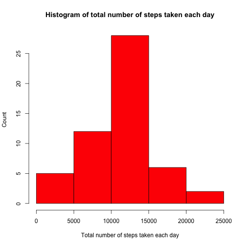
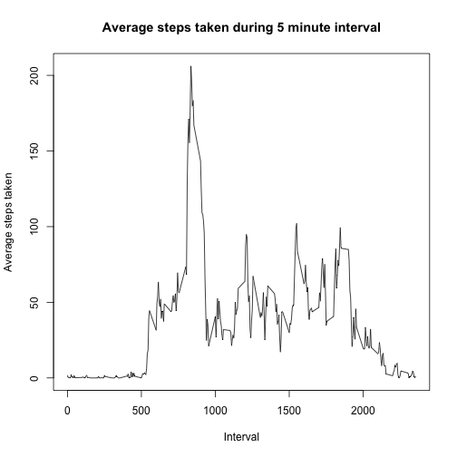
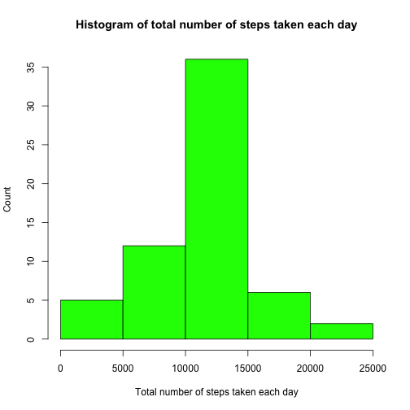
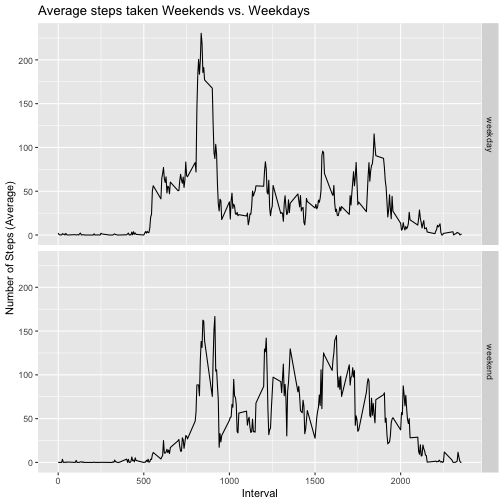

## PA1_template.Rmd

---
title: "Report_Week2_ReproducibleResearch"
author: "JustynaW"
date: "4/13/2020"
output: html_document
---


# **Project description**
This assignment makes use of data from a personal activity monitoring device. 
This device collects data at 5 minute intervals through out the day. 
The data consists of two months of data from an anonymous individual collected 
during the months of October and November, 2012 and include the number of steps 
taken in 5 minute intervals each day.


# **The variables included in this dataset are** \ 
* steps: Number of steps taking in a 5-minute interval (missing values are coded as NA)
* date: The date on which the measurement was taken in YYYY-MM-DD format
* interval: Identifier for the 5-minute interval in which measurement was taken

The dataset is stored in a comma-separated-value (CSV) file and there are a total 
of 17,568 observations in this dataset


# **Options** 
Always use echo = TRUE


# **Libraries** 

```r
library(lubridate)
library(dplyr)
library(ggplot2)
library(knitr)
```


# **Unzip Data**
Unzip Data and list files in the folder to confirm that new file, activity.csv exists

```r
unzip("activity.zip")
list.files()
```

```
##  [1] "activity.csv"                           "activity.zip"                          
##  [3] "doc"                                    "figure"                                
##  [5] "instructions_fig"                       "PA1_template.html"                     
##  [7] "PA1_template.Rmd"                       "README.md"                             
##  [9] "RepData_PeerAssessment1.Rproj"          "Report_Week2_ReproducibleResearch.html"
## [11] "Report_Week2_ReproducibleResearch.md"   "Report_Week2_ReproducibleResearch.Rmd"
```


# **Load Data**
1) Load data
2) change date format from factor to Date
3) Eliminate NAs


```r
rawdata = read.csv("activity.csv")
rawdata$date = as.Date(as.character(rawdata$date, "%y/%m/%d"))
data = tbl_df(na.omit(rawdata))
```


# **What is mean total number of steps taken per day?**
This code chunk will output: \
1) Histogram of the total number of steps taken each day  
2) mean and median total number of steps taken per day


1. Histogram of the total number of steps taken each day

```r
# Group data by date, and summarize the sum of steps
stepsperday =  data %>% 
        group_by(date) %>% 
        summarize(TotalSteps=sum(steps)) 

# Show histogram of steps per day
with(stepsperday, hist(TotalSteps, 
                       xlab="Total number of steps taken each day", 
                       ylab="Count", 
                       main="Histogram of total number of steps taken each day", 
                       col="red") 
)
```




2. Output mean and median of steps taken per day

```r
meansteps = mean(stepsperday$TotalSteps)
mediansteps = median(stepsperday$TotalSteps)

print(paste0("The mean total number of steps per day is ", meansteps, " and the median is " , mediansteps))
```

```
## [1] "The mean total number of steps per day is 10766.1886792453 and the median is 10765"
```


# **What is the average daily activity pattern?**
1) Make a time series plot (i.e. type = "l") of the 5-minute interval (x-axis) and 
the average number of steps taken, averaged across all days (y-axis).
2) Which 5-minute interval, on average across all the days in the dataset, contains the maximum number of steps??


1. Make a time series plot (i.e. type = "l") of the 5-minute interval (x-axis) and 
the average number of steps taken, averaged across all days (y-axis).


```r
# Group data by 5 minute interval and summarize the average number of steps in that interval
FiveMinuteAverage <- data %>%
    group_by(interval) %>%
    summarize(AverageSteps=mean(steps))

# Make an average activity plot
with(FiveMinuteAverage, plot(interval, AverageSteps, 
                             type="l",
                             xlab="Interval",
                             ylab="Average steps taken",
                             main="Average steps taken during 5 minute interval") 
)
```




2. Which 5-minute interval, on average across all the days in the dataset, contains the maximum number of steps??**

```r
maxstepinterval <- FiveMinuteAverage$interval[which.max(FiveMinuteAverage$AverageSteps)]
paste0("Interval with maximal number of step is ", maxstepinterval)
```

```
## [1] "Interval with maximal number of step is 835"
```


# **Imputing missing values**
1) Calculate and report the total number of missing values in the dataset (i.e. the total number of rows with NAs)
2) Devise a strategy for filling in all of the missing values in the dataset. The strategy does not need to be sophisticated. For example, you could use the mean/median for that day, or the mean for that 5-minute interval, etc.
3) Create a new dataset that is equal to the original dataset but with the missing data filled in.
4) Make a histogram of the total number of steps taken each day and calculate and report the mean and median total number of steps taken per day. 
5) Do these values differ from the estimates from the first part of the assignment? What is the impact of imputing missing data on the estimates of the total daily number of steps?


1. Calculate number of missing values

```r
missing <- sum(is.na(rawdata$steps))
paste0("There are ", missing, " NAs found in the raw data set.")
```

```
## [1] "There are 2304 NAs found in the raw data set."
```


2 and 3. Strategy for filling missing values. To fill in the NAs, we will take the 
average number of steps during that 5 minute interval over each day and 
assign it to that particular NA.

```r
filldata = rawdata

for( row in 1:nrow(filldata) ) {
        
        if (is.na(filldata$steps[row])) {
        # Find the index value for when the 5min interval matches the averaged value
        index <- which(filldata$interval[row] == FiveMinuteAverage$interval)
        # Assign the value to replace the NA
        filldata$steps[row] <- FiveMinuteAverage[index,]$AverageSteps
    }
}
```


4. Make a histogram of the total number of steps taken each day and calculate 
and report the mean and median total number of steps taken per day. 
Do these values differ from the estimates from the first part of the assignment? 


```r
# Group data by date, and summarize the sum of steps
stepsperday_filledNA = filldata %>% 
        group_by(date) %>% 
        summarize(TotalSteps=sum(steps)) 
unique(stepsperday_filledNA$date)
```

```
##  [1] "2012-10-01" "2012-10-02" "2012-10-03" "2012-10-04" "2012-10-05" "2012-10-06" "2012-10-07" "2012-10-08" "2012-10-09"
## [10] "2012-10-10" "2012-10-11" "2012-10-12" "2012-10-13" "2012-10-14" "2012-10-15" "2012-10-16" "2012-10-17" "2012-10-18"
## [19] "2012-10-19" "2012-10-20" "2012-10-21" "2012-10-22" "2012-10-23" "2012-10-24" "2012-10-25" "2012-10-26" "2012-10-27"
## [28] "2012-10-28" "2012-10-29" "2012-10-30" "2012-10-31" "2012-11-01" "2012-11-02" "2012-11-03" "2012-11-04" "2012-11-05"
## [37] "2012-11-06" "2012-11-07" "2012-11-08" "2012-11-09" "2012-11-10" "2012-11-11" "2012-11-12" "2012-11-13" "2012-11-14"
## [46] "2012-11-15" "2012-11-16" "2012-11-17" "2012-11-18" "2012-11-19" "2012-11-20" "2012-11-21" "2012-11-22" "2012-11-23"
## [55] "2012-11-24" "2012-11-25" "2012-11-26" "2012-11-27" "2012-11-28" "2012-11-29" "2012-11-30"
```

```r
# Show histogram of steps per day
with(stepsperday_filledNA, hist(TotalSteps, 
                       xlab="Total number of steps taken each day", 
                       ylab="Count", 
                       main="Histogram of total number of steps taken each day", 
                       col="green") 
)
```




5. Do mean and median values differ from the estimates from the first part of the assignment? 
What is the impact of imputing missing data on the estimates of the total daily number of steps?

```r
# Output mean and median of steps taken per day
meansteps_filledNA = mean(stepsperday_filledNA$TotalSteps)
mediansteps_filledNA = median(stepsperday_filledNA$TotalSteps)

print(paste0("The mean total number of steps per day is ", meansteps_filledNA, " and the median is " , mediansteps_filledNA))
```

```
## [1] "The mean total number of steps per day is 10766.1886792453 and the median is 10766.1886792453"
```
It looks like mean values are similar but the median value in dataset with imputed NAs is slighty increased.


# **Are there differences in activity patterns between weekdays and weekends?**
1) Create a new factor variable in the dataset with two levels - “weekday” and “weekend” indicating whether a given date is a weekday or weekend day.
2) Make a panel plot containing a time series plot (i.e. type = “l”) of the 5-minute interval (x-axis) and the average number of steps taken, averaged across all weekday days or weekend days (y-axis). See the README file in the GitHub repository to see an example of what this plot should look like using simulated data.


1. Make a variable for the day of the week, and use that to make a “weekend/weeday” variable

```r
# Make weekday variable
filldata$day <- weekdays(filldata$date)
# Define all days as weekdays
filldata$daytype <- "weekday"
# Set saturdays oand sundays to be weekends
filldata$daytype[filldata$day %in% c("Saturday", "Sunday")] <- "weekend"
```


Calculate the average weekday steps versus average weekend steps

```r
# Group data by 5 minute interval and summarize the average
# number of steps in that interval
dayaveragedata <- filldata %>%
    group_by(daytype, interval) %>%
    summarize(AverageSteps=mean(steps))
```


2. Make a plot of weekdays versus weekends using ggplot2

```r
# Use qplot because facets easily divides the graph into two better than
# the base graphics system.
qplot(interval, AverageSteps, 
      data=dayaveragedata,
      geom="line",
      xlab="Interval",
      ylab="Number of Steps (Average)",
      main="Average steps taken Weekends vs. Weekdays",
      facets =daytype ~ .)
```


